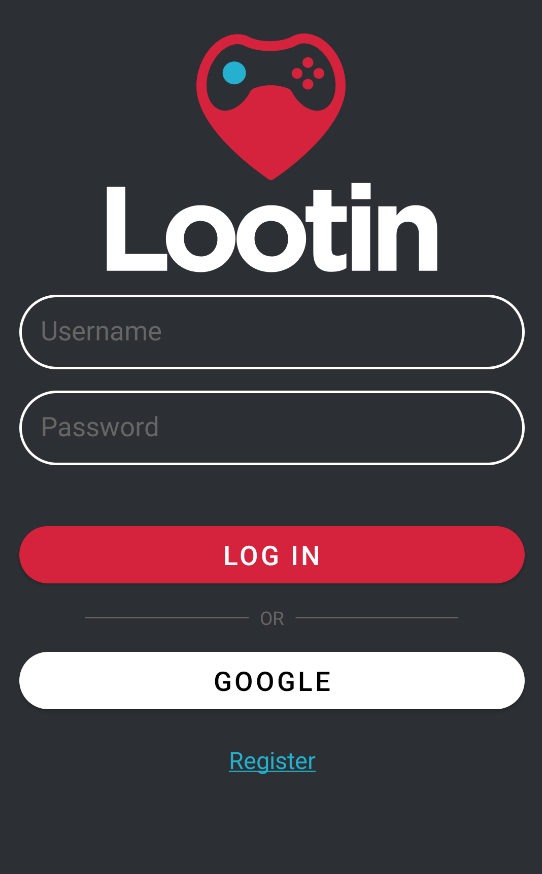

<p align="center">
    
    <h1 align="center">Lootin</h1>
    <p align="center">A gamers meeting place</p>
</p>

<details open="open">
  <summary>Table of Contents</summary>
  <ol>
    <li>
      <a href="#about-the-project">About The Project</a>
      <ul>
        <li><a href="#built-with">Developed with</a></li>
      </ul>
    </li>
    <li>
      <a href="#getting-started">Getting Started</a>
      <ul>
        <li><a href="#prerequisites">Clone the Repository</a></li>
      </ul>
    </li>
    <li>
      <a href="#Configuration">Configuration</a>
      <ul>
        <li><a href="#sdk-path">SDK Path</a></li>
        <li><a href="#setting-up-ip-address">Setting up IP address</a></li>
        <li><a href="#launch-application">Launch application</a></li>
      </ul>
    </li>
    <li>
      <a href="#developers">Developers</a>
    </li>
  </ol>
</details>

## About The Project
<p align="center">
    
</p>
🎮 Lootin, this is THE gamers meeting place.
Lootin allows you to meet gamers who match your criteria. Create an account, select your favorite games and join the game !
Lootin will offer you a selection of profiles chosen according to your attractions and your games preferences.
Thanks to its profile creation tool, Lootin will find the most relevant profiles according to your criteria.
If you are interested in a profile Loot it 💖 ! Otherwise, drop it ❌.
If you like each other, it's a Loot!
Chat with your Loots will allow you to meet new people and maybe find the gamer which is made for you !
So what are you waiting for? Enter the game!


### Developed with
* [Kotlin](https://kotlinlang.org/)

## Getting Started
### Clone the Repository
As usual, you get started by cloning the project to your local machine:
```
git clone https://github.com/Lootin-IGM/Front.git
```

## Configuration
### SDK Path
First of all, set your sdk directory in the local.properties: ```sdk.dir=your/sdk/path```

### Setting up IP address
In the src/main/assets/config.json file, set your own IP address in the ip field:
```JSON
{
  "ip": "" //set here your IP
}
```

### Launch application
The easiest way to build and run Lootin is to open it in Android Studio and simply press the run button after choosing the emulator or the device where to run the application.

## Developers
This project was developed by:
* [BESNARD Pierre-Jean](https://github.com/PJbesnard)
* [BILLAUT Louis](https://github.com/LouisBillaut)
* [CALONNE Thomas](https://github.com/calonnet)
* [CROHARE Jeanne](https://github.com/jcrohare)
* [JUILLARD Thomas](https://github.com/JUILLARD-Thomas)
* [LIEGEY Armand](https://github.com/afkeu)